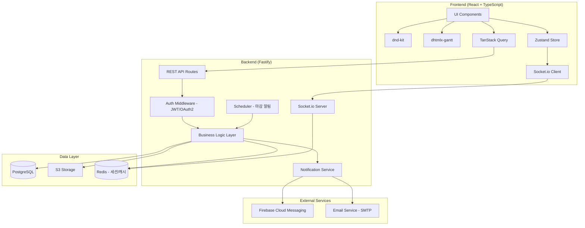
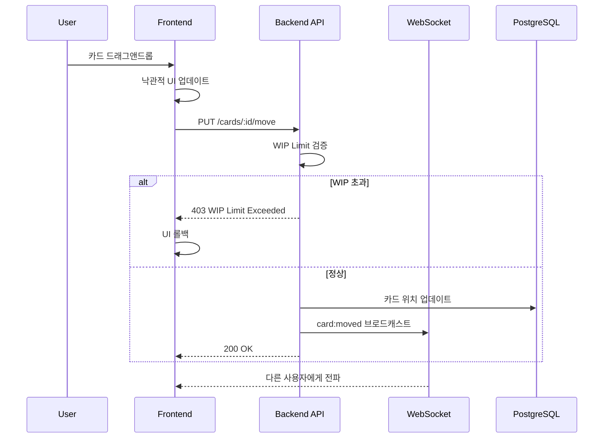
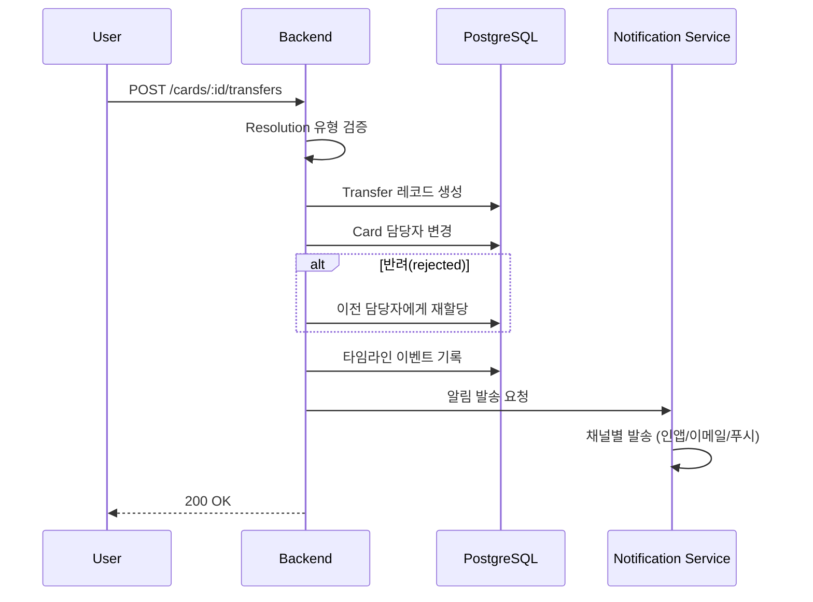
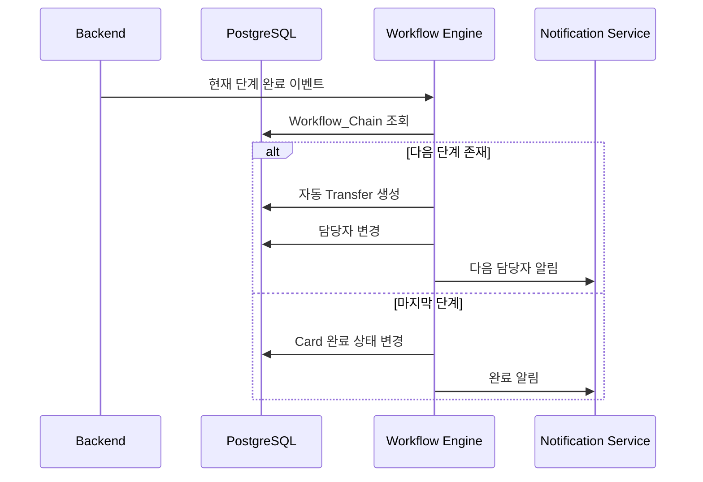
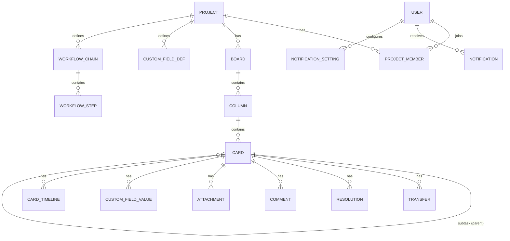

# 기술 설계 문서: Project Management Flow Board

## Overview

Flow 스타일의 프로젝트 관리 SaaS 서비스를 위한 기술 설계 문서이다. 칸반 보드 기반 업무 상태 관리, 업무 이관 워크플로우, 처리 결과 기록, 알림 시스템, 멀티 뷰 지원을 핵심으로 한다.

### 기술 스택

| 영역 | 기술 |
|------|------|
| Frontend | React + TypeScript + Tailwind CSS + shadcn/ui |
| Backend | Node.js (Fastify) |
| Database | PostgreSQL |
| 실시간 통신 | WebSocket (Socket.io) |
| 드래그앤드롭 | dnd-kit |
| 간트차트 | dhtmlx-gantt |
| 상태관리 | TanStack Query + Zustand |
| 인증 | JWT + OAuth2 |
| 파일저장 | S3 호환 스토리지 |
| 푸시 알림 | FCM (Firebase Cloud Messaging) |

### 핵심 설계 원칙

- **실시간 우선**: WebSocket 기반 실시간 동기화로 협업 경험 극대화
- **낙관적 UI**: 클라이언트 먼저 반영 후 서버 확인 (충돌 시 롤백)
- **이벤트 기반**: 업무 이관/상태 변경을 이벤트로 기록하여 추적성 확보
- **뷰 독립성**: 데이터 모델과 뷰 렌더링을 분리하여 멀티 뷰 지원


## Architecture

### 시스템 아키텍처 다이어그램



### 계층 구조

1. **Presentation Layer**: React 컴포넌트, 뷰 렌더링, 사용자 인터랙션
2. **State Layer**: TanStack Query (서버 상태), Zustand (클라이언트 상태)
3. **Transport Layer**: REST API (CRUD), WebSocket (실시간 이벤트)
4. **Business Layer**: 이관 로직, WIP 검증, 워크플로우 체인 실행
5. **Data Layer**: PostgreSQL (영속 데이터), Redis (세션/캐시), S3 (파일)


## Components and Interfaces

### Backend 모듈 구조

```
src/
├── modules/
│   ├── auth/           # 인증/인가
│   ├── project/        # 프로젝트 CRUD, 멤버 관리
│   ├── board/          # 보드, 컬럼 관리
│   ├── card/           # 카드 CRUD, 서브태스크
│   ├── transfer/       # 이관 로직 (수동/자동)
│   ├── resolution/     # 처리 결과 기록
│   ├── notification/   # 알림 발송 (인앱/이메일/푸시)
│   ├── dashboard/      # 대시보드 집계
│   ├── file/           # 파일 업로드/다운로드
│   └── realtime/       # WebSocket 이벤트 관리
├── shared/
│   ├── middleware/     # 인증, 권한, 에러 핸들링
│   ├── database/       # DB 연결, 마이그레이션
│   └── utils/          # 공통 유틸리티
└── app.ts              # Fastify 앱 진입점
```

### Frontend 컴포넌트 구조

```
src/
├── components/
│   ├── board/          # BoardView, Column, CardItem
│   ├── card/           # CardDetail, CardForm, SubtaskTree
│   ├── transfer/       # TransferDialog, ResolutionForm
│   ├── views/          # ListView, GanttView, CalendarView
│   ├── dashboard/      # ProgressChart, BottleneckChart
│   ├── notification/   # NotificationPanel, NotificationItem
│   ├── my-tasks/       # MyTasksList, TaskCard
│   └── common/         # Layout, Modal, Avatar, Badge
├── hooks/
│   ├── useBoard.ts
│   ├── useCards.ts
│   ├── useTransfer.ts
│   ├── useRealtime.ts
│   └── useNotification.ts
├── stores/
│   ├── boardStore.ts   # 보드 실시간 상태
│   ├── uiStore.ts      # UI 상태 (모달, 사이드바)
│   └── authStore.ts    # 인증 상태
├── api/                # API 클라이언트 (TanStack Query)
├── types/              # TypeScript 타입 정의
└── App.tsx
```

### 핵심 인터페이스

```typescript
// 카드 이동 요청
interface MoveCardRequest {
  cardId: string;
  targetColumnId: string;
  position: number;        // 컬럼 내 순서
  transferTo?: string;     // 동시 이관 시 대상 멤버 ID
  resolution?: Resolution; // 이관 시 처리 결과
}

// 이관 요청
interface TransferRequest {
  cardId: string;
  toUserId: string;
  resolutionType: 'approved' | 'rejected' | 'completed' | 'hold';
  comment?: string;
  attachments?: string[];
}

// WebSocket 이벤트
interface WsEvent {
  type: 'card:moved' | 'card:updated' | 'card:created' 
      | 'card:deleted' | 'transfer:created' | 'column:updated';
  projectId: string;
  payload: Record<string, unknown>;
  version: number;  // 낙관적 잠금용 버전
  timestamp: string;
}

// 알림
interface Notification {
  id: string;
  userId: string;
  type: NotificationType;
  title: string;
  body: string;
  metadata: Record<string, unknown>;
  channels: ('in_app' | 'email' | 'push')[];
  read: boolean;
  createdAt: string;
}
```


### REST API 엔드포인트

#### 프로젝트 관리
| Method | Path | 설명 |
|--------|------|------|
| POST | /api/projects | 프로젝트 생성 |
| GET | /api/projects | 프로젝트 목록 조회 |
| GET | /api/projects/:id | 프로젝트 상세 조회 |
| PUT | /api/projects/:id | 프로젝트 수정 |
| DELETE | /api/projects/:id | 프로젝트 삭제 |
| POST | /api/projects/:id/members | 멤버 추가 |
| PUT | /api/projects/:id/members/:userId | 멤버 역할 변경 |
| DELETE | /api/projects/:id/members/:userId | 멤버 제거 |

#### 보드/컬럼 관리
| Method | Path | 설명 |
|--------|------|------|
| GET | /api/projects/:id/board | 보드 전체 조회 |
| POST | /api/projects/:id/columns | 컬럼 생성 |
| PUT | /api/columns/:id | 컬럼 수정 (이름, WIP) |
| PUT | /api/columns/reorder | 컬럼 순서 변경 |
| DELETE | /api/columns/:id | 컬럼 삭제 |

#### 카드 관리
| Method | Path | 설명 |
|--------|------|------|
| POST | /api/columns/:id/cards | 카드 생성 |
| GET | /api/cards/:id | 카드 상세 조회 |
| PUT | /api/cards/:id | 카드 수정 |
| DELETE | /api/cards/:id | 카드 삭제 |
| PUT | /api/cards/:id/move | 카드 이동 (컬럼 간) |
| POST | /api/cards/:id/subtasks | 서브태스크 생성 |
| POST | /api/cards/:id/comments | 댓글 추가 |
| POST | /api/cards/:id/attachments | 파일 첨부 |

#### 이관/처리 결과
| Method | Path | 설명 |
|--------|------|------|
| POST | /api/cards/:id/transfers | 수동 이관 생성 |
| GET | /api/cards/:id/transfers | 이관 이력 조회 |
| POST | /api/cards/:id/resolutions | 처리 결과 기록 |
| GET | /api/cards/:id/resolutions | 처리 결과 이력 조회 |

#### 워크플로우 체인
| Method | Path | 설명 |
|--------|------|------|
| POST | /api/projects/:id/workflows | 워크플로우 체인 생성 |
| GET | /api/projects/:id/workflows | 워크플로우 목록 조회 |
| PUT | /api/workflows/:id | 워크플로우 수정 |
| DELETE | /api/workflows/:id | 워크플로우 삭제 |

#### 뷰/대시보드
| Method | Path | 설명 |
|--------|------|------|
| GET | /api/projects/:id/cards/list | 리스트 뷰 데이터 |
| GET | /api/projects/:id/cards/gantt | 간트차트 뷰 데이터 |
| GET | /api/projects/:id/cards/calendar | 캘린더 뷰 데이터 |
| GET | /api/projects/:id/dashboard | 대시보드 집계 데이터 |
| GET | /api/my-tasks | 내 업무 목록 |

#### 알림
| Method | Path | 설명 |
|--------|------|------|
| GET | /api/notifications | 알림 목록 조회 |
| PUT | /api/notifications/:id/read | 알림 읽음 처리 |
| PUT | /api/notifications/settings | 알림 설정 변경 |


### WebSocket 이벤트 설계

#### 연결 및 구독

```typescript
// 클라이언트 → 서버: 프로젝트 룸 참가
socket.emit('join:project', { projectId: string });

// 클라이언트 → 서버: 프로젝트 룸 퇴장
socket.emit('leave:project', { projectId: string });
```

#### 서버 → 클라이언트 이벤트

| 이벤트 | 페이로드 | 트리거 |
|--------|----------|--------|
| `card:moved` | cardId, fromCol, toCol, position, version | 카드 이동 |
| `card:updated` | cardId, changes, version | 카드 속성 수정 |
| `card:created` | card 전체 객체 | 카드 생성 |
| `card:deleted` | cardId | 카드 삭제 |
| `column:updated` | columnId, changes | 컬럼 수정 |
| `transfer:created` | transfer 객체 | 이관 발생 |
| `conflict:detected` | cardId, serverVersion, clientVersion | 충돌 감지 |

#### 재연결 동기화

```typescript
// 재연결 시 마지막 수신 이벤트 버전 전송
socket.emit('sync:request', { 
  projectId: string, 
  lastEventVersion: number 
});

// 서버가 누락된 이벤트 일괄 전송
socket.on('sync:response', (events: WsEvent[]) => {});
```


### 핵심 비즈니스 로직

#### 1. 카드 이동 (칸반 드래그앤드롭)



#### 2. 업무 이관 플로우



#### 3. 자동 워크플로우 체인




#### 4. 낙관적 잠금 (Optimistic Locking)

각 Card에 `version` 필드를 유지한다. 수정 요청 시 클라이언트가 보유한 version과 DB의 현재 version을 비교한다.

```sql
UPDATE cards 
SET title = $1, version = version + 1 
WHERE id = $2 AND version = $3;
-- affected rows = 0이면 충돌 발생
```

충돌 시:
1. 서버가 `conflict:detected` WebSocket 이벤트 발송
2. 클라이언트가 최신 데이터를 fetch하여 사용자에게 충돌 알림
3. 사용자가 수동으로 병합 결정

#### 5. 마감 알림 스케줄러

Cron 기반 스케줄러가 매일 09:00에 실행:
- D-3, D-1, D-day, 기한 초과 카드를 조회
- 각 조건에 맞는 알림을 Notification Service로 전달
- 중복 발송 방지를 위해 `notification_sent_log` 테이블 활용


## Data Models

### ERD 다이어그램



### 테이블 스키마

#### users
| 컬럼 | 타입 | 설명 |
|------|------|------|
| id | UUID (PK) | 사용자 ID |
| email | VARCHAR(255) | 이메일 (unique) |
| name | VARCHAR(100) | 이름 |
| avatar_url | TEXT | 프로필 이미지 URL |
| password_hash | TEXT | 비밀번호 해시 (OAuth 시 null) |
| oauth_provider | VARCHAR(50) | OAuth 제공자 |
| created_at | TIMESTAMPTZ | 생성일 |
| updated_at | TIMESTAMPTZ | 수정일 |

#### projects
| 컬럼 | 타입 | 설명 |
|------|------|------|
| id | UUID (PK) | 프로젝트 ID |
| name | VARCHAR(200) | 프로젝트 이름 |
| description | TEXT | 설명 |
| is_public | BOOLEAN | 공개 여부 |
| owner_id | UUID (FK → users) | 소유자 |
| resolution_required | BOOLEAN | Resolution 필수 여부 |
| created_at | TIMESTAMPTZ | 생성일 |
| updated_at | TIMESTAMPTZ | 수정일 |

#### project_members
| 컬럼 | 타입 | 설명 |
|------|------|------|
| id | UUID (PK) | 멤버십 ID |
| project_id | UUID (FK → projects) | 프로젝트 |
| user_id | UUID (FK → users) | 사용자 |
| role | ENUM('owner','admin','member') | 역할 |
| joined_at | TIMESTAMPTZ | 참여일 |

#### boards
| 컬럼 | 타입 | 설명 |
|------|------|------|
| id | UUID (PK) | 보드 ID |
| project_id | UUID (FK → projects) | 프로젝트 |
| name | VARCHAR(200) | 보드 이름 |
| created_at | TIMESTAMPTZ | 생성일 |

#### columns
| 컬럼 | 타입 | 설명 |
|------|------|------|
| id | UUID (PK) | 컬럼 ID |
| board_id | UUID (FK → boards) | 보드 |
| name | VARCHAR(100) | 컬럼 이름 |
| position | INTEGER | 순서 |
| wip_limit | INTEGER NULL | WIP 제한 (null=무제한) |
| created_at | TIMESTAMPTZ | 생성일 |

#### cards
| 컬럼 | 타입 | 설명 |
|------|------|------|
| id | UUID (PK) | 카드 ID |
| column_id | UUID (FK → columns) | 소속 컬럼 |
| parent_id | UUID (FK → cards, NULL) | 상위 카드 (서브태스크) |
| title | VARCHAR(500) | 제목 |
| description | TEXT | 설명 |
| priority | ENUM('urgent','high','normal','low') | 우선순위 |
| assignee_id | UUID (FK → users, NULL) | 담당자 |
| start_date | DATE NULL | 시작일 |
| due_date | DATE NULL | 마감일 |
| status | ENUM('todo','in_progress','done') | 상태 |
| position | INTEGER | 컬럼 내 순서 |
| version | INTEGER DEFAULT 1 | 낙관적 잠금 버전 |
| tags | TEXT[] | 태그 배열 |
| created_by | UUID (FK → users) | 생성자 |
| created_at | TIMESTAMPTZ | 생성일 |
| updated_at | TIMESTAMPTZ | 수정일 |

#### transfers
| 컬럼 | 타입 | 설명 |
|------|------|------|
| id | UUID (PK) | 이관 ID |
| card_id | UUID (FK → cards) | 대상 카드 |
| from_user_id | UUID (FK → users) | 발신자 |
| to_user_id | UUID (FK → users) | 수신자 |
| resolution_type | ENUM('approved','rejected','completed','hold') | 처리 유형 |
| comment | TEXT | 이관 코멘트 |
| is_auto | BOOLEAN DEFAULT false | 자동 이관 여부 |
| workflow_step_id | UUID (FK, NULL) | 워크플로우 단계 |
| created_at | TIMESTAMPTZ | 이관 시각 |

#### resolutions
| 컬럼 | 타입 | 설명 |
|------|------|------|
| id | UUID (PK) | Resolution ID |
| card_id | UUID (FK → cards) | 대상 카드 |
| transfer_id | UUID (FK → transfers, NULL) | 연관 이관 |
| type | ENUM('approved','rejected','completed','hold') | 유형 |
| comment | TEXT | 결과 코멘트 |
| created_by | UUID (FK → users) | 기록자 |
| created_at | TIMESTAMPTZ | 기록 시각 |

#### workflow_chains
| 컬럼 | 타입 | 설명 |
|------|------|------|
| id | UUID (PK) | 워크플로우 ID |
| project_id | UUID (FK → projects) | 프로젝트 |
| trigger_column_id | UUID (FK → columns) | 트리거 컬럼 |
| name | VARCHAR(200) | 워크플로우 이름 |
| is_active | BOOLEAN DEFAULT true | 활성 여부 |
| created_at | TIMESTAMPTZ | 생성일 |

#### workflow_steps
| 컬럼 | 타입 | 설명 |
|------|------|------|
| id | UUID (PK) | 단계 ID |
| chain_id | UUID (FK → workflow_chains) | 워크플로우 |
| assignee_id | UUID (FK → users) | 담당자 |
| step_order | INTEGER | 순서 |
| created_at | TIMESTAMPTZ | 생성일 |

#### comments
| 컬럼 | 타입 | 설명 |
|------|------|------|
| id | UUID (PK) | 댓글 ID |
| card_id | UUID (FK → cards) | 대상 카드 |
| author_id | UUID (FK → users) | 작성자 |
| content | TEXT | 댓글 내용 |
| mentions | UUID[] | 멘션된 사용자 ID 배열 |
| created_at | TIMESTAMPTZ | 작성일 |
| updated_at | TIMESTAMPTZ | 수정일 |

#### attachments
| 컬럼 | 타입 | 설명 |
|------|------|------|
| id | UUID (PK) | 첨부파일 ID |
| card_id | UUID (FK → cards) | 대상 카드 |
| transfer_id | UUID (FK → transfers, NULL) | 연관 이관 |
| resolution_id | UUID (FK → resolutions, NULL) | 연관 Resolution |
| file_name | VARCHAR(500) | 파일명 |
| file_size | BIGINT | 파일 크기 (bytes) |
| mime_type | VARCHAR(100) | MIME 타입 |
| s3_key | TEXT | S3 저장 경로 |
| uploaded_by | UUID (FK → users) | 업로더 |
| created_at | TIMESTAMPTZ | 업로드일 |

#### notifications
| 컬럼 | 타입 | 설명 |
|------|------|------|
| id | UUID (PK) | 알림 ID |
| user_id | UUID (FK → users) | 수신자 |
| type | VARCHAR(50) | 알림 유형 |
| title | VARCHAR(300) | 알림 제목 |
| body | TEXT | 알림 본문 |
| metadata | JSONB | 추가 데이터 (cardId, projectId 등) |
| is_read | BOOLEAN DEFAULT false | 읽음 여부 |
| created_at | TIMESTAMPTZ | 생성일 |

#### notification_settings
| 컬럼 | 타입 | 설명 |
|------|------|------|
| id | UUID (PK) | 설정 ID |
| user_id | UUID (FK → users) | 사용자 |
| notification_type | VARCHAR(50) | 알림 유형 |
| channel_in_app | BOOLEAN DEFAULT true | 인앱 수신 |
| channel_email | BOOLEAN DEFAULT true | 이메일 수신 |
| channel_push | BOOLEAN DEFAULT true | 푸시 수신 |

#### card_timeline
| 컬럼 | 타입 | 설명 |
|------|------|------|
| id | UUID (PK) | 이벤트 ID |
| card_id | UUID (FK → cards) | 대상 카드 |
| event_type | VARCHAR(50) | 이벤트 유형 |
| actor_id | UUID (FK → users) | 행위자 |
| payload | JSONB | 이벤트 상세 데이터 |
| created_at | TIMESTAMPTZ | 발생 시각 |

#### custom_field_definitions
| 컬럼 | 타입 | 설명 |
|------|------|------|
| id | UUID (PK) | 필드 정의 ID |
| project_id | UUID (FK → projects) | 프로젝트 |
| name | VARCHAR(100) | 필드 이름 |
| field_type | ENUM('text','number','date','select','multi_select') | 필드 유형 |
| options | JSONB NULL | 선택지 (select/multi_select용) |
| created_at | TIMESTAMPTZ | 생성일 |

#### custom_field_values
| 컬럼 | 타입 | 설명 |
|------|------|------|
| id | UUID (PK) | 값 ID |
| card_id | UUID (FK → cards) | 대상 카드 |
| field_id | UUID (FK → custom_field_definitions) | 필드 정의 |
| value | JSONB | 값 (유형에 따라 다름) |

#### notification_sent_log
| 컬럼 | 타입 | 설명 |
|------|------|------|
| id | UUID (PK) | 로그 ID |
| card_id | UUID (FK → cards) | 대상 카드 |
| notification_type | VARCHAR(50) | 알림 유형 |
| sent_date | DATE | 발송일 |
| created_at | TIMESTAMPTZ | 생성일 |

### 주요 인덱스

```sql
-- 카드 조회 성능
CREATE INDEX idx_cards_column_position ON cards(column_id, position);
CREATE INDEX idx_cards_assignee ON cards(assignee_id);
CREATE INDEX idx_cards_due_date ON cards(due_date);
CREATE INDEX idx_cards_parent ON cards(parent_id);

-- 이관 이력 조회
CREATE INDEX idx_transfers_card ON transfers(card_id, created_at);
CREATE INDEX idx_transfers_to_user ON transfers(to_user_id);

-- 알림 조회
CREATE INDEX idx_notifications_user_unread 
  ON notifications(user_id, is_read) WHERE is_read = false;

-- 타임라인 조회
CREATE INDEX idx_timeline_card ON card_timeline(card_id, created_at);

-- 대시보드 집계
CREATE INDEX idx_cards_status ON cards(status);
CREATE INDEX idx_timeline_event_type 
  ON card_timeline(event_type, created_at);
```


## Correctness Properties

*A property is a characteristic or behavior that should hold true across all valid executions of a system—essentially, a formal statement about what the system should do. Properties serve as the bridge between human-readable specifications and machine-verifiable correctness guarantees.*

### Property 1: 프로젝트 CRUD Round Trip

*For any* 유효한 프로젝트 데이터(이름, 설명, 공개 설정), 프로젝트를 생성한 후 조회하면 동일한 데이터가 반환되어야 한다.

**Validates: Requirements 1.1**

### Property 2: 프로젝트 생성 시 소유자 자동 지정

*For any* 사용자가 프로젝트를 생성하면, 해당 사용자는 자동으로 'owner' 역할의 프로젝트 멤버로 등록되어야 한다.

**Validates: Requirements 1.2**

### Property 3: 역할-권한 매핑 일관성

*For any* 프로젝트 멤버와 할당된 역할(owner, admin, member)에 대해, 해당 역할에 정의된 권한 집합이 정확히 부여되어야 한다.

**Validates: Requirements 1.3, 1.4**


### Property 4: 카드 생성 Round Trip

*For any* 유효한 카드 데이터(제목, 설명, 우선순위, 태그, 담당자, 시작일, 마감일), 카드를 생성한 후 조회하면 동일한 데이터가 반환되고, 지정된 컬럼에 배치되어야 한다.

**Validates: Requirements 2.1, 2.3**

### Property 5: 우선순위 유효성 검증

*For any* 카드 생성/수정 요청에서, 우선순위 값은 반드시 'urgent', 'high', 'normal', 'low' 중 하나여야 하며, 그 외의 값은 거부되어야 한다.

**Validates: Requirements 2.2**

### Property 6: 서브태스크 완료 검증

*For any* 상위 카드와 그 하위 서브태스크 트리에서, 하나라도 미완료 서브태스크가 존재하면 상위 카드를 완료 상태로 변경하는 것이 거부되어야 한다.

**Validates: Requirements 2.5**

### Property 7: 파일 첨부 Round Trip

*For any* 유효한 파일을 카드에 업로드한 후 다운로드하면, 원본 파일과 동일한 내용이 반환되어야 한다.

**Validates: Requirements 2.6**


### Property 8: Custom Field 값 Round Trip

*For any* 유효한 Custom Field 정의(텍스트, 숫자, 날짜, 단일선택, 다중선택)와 해당 유형에 맞는 값을 카드에 저장한 후 조회하면, 동일한 값이 반환되어야 한다.

**Validates: Requirements 2.7**

### Property 9: 멘션 파싱 정확성

*For any* @ 기호가 포함된 댓글 텍스트에서, 시스템은 유효한 사용자 멘션을 정확히 추출하고, 멘션된 각 사용자에게 알림을 생성해야 한다.

**Validates: Requirements 2.8, 2.9**

### Property 10: WIP Limit 강제

*For any* WIP Limit이 설정된 컬럼에서, 해당 컬럼의 카드 수가 WIP Limit에 도달한 상태에서 추가 카드 이동 요청은 거부되어야 한다.

**Validates: Requirements 3.2, 3.3**

### Property 11: 카드 이동 시 상태 갱신 및 담당자 보존

*For any* 카드가 Transfer 없이 다른 컬럼으로 이동될 때, 카드의 상태는 대상 컬럼에 맞게 갱신되어야 하고, 담당자는 변경되지 않아야 한다.

**Validates: Requirements 3.5, 3.6, 9.1**


### Property 12: 뷰 간 데이터 일관성

*For any* 프로젝트의 카드 집합에 대해, 보드 뷰, 리스트 뷰, 간트차트 뷰, 캘린더 뷰 모두 동일한 카드 ID 집합을 반환해야 한다 (데이터 손실 없음).

**Validates: Requirements 4.2**

### Property 13: 간트차트 배치 정확성

*For any* 시작일과 마감일이 설정된 카드에 대해, 간트차트 뷰 데이터의 시작/종료 위치는 카드의 시작일/마감일과 정확히 일치해야 한다.

**Validates: Requirements 4.3**

### Property 14: 캘린더 배치 정확성

*For any* 마감일이 설정된 카드에 대해, 캘린더 뷰에서 해당 카드는 마감일 날짜에 배치되어야 한다.

**Validates: Requirements 4.4**

### Property 15: 리스트 뷰 정렬 정확성

*For any* 카드 집합에 대해, 리스트 뷰는 컬럼 상태별로 그룹화하고, 각 그룹 내에서 지정된 기준(우선순위, 마감일, 담당자)으로 올바르게 정렬해야 한다.

**Validates: Requirements 4.5**


### Property 16: 이관 유효성 검증

*For any* 수동 이관 요청에서, toUserId는 프로젝트 멤버여야 하고, resolutionType은 'approved', 'rejected', 'completed', 'hold' 중 하나여야 하며, 이 조건을 만족하지 않으면 거부되어야 한다.

**Validates: Requirements 5.1, 5.2, 7.1**

### Property 17: 반려 시 자동 재할당

*For any* 'rejected' 유형의 이관이 발생하면, 카드의 담당자는 이관 발신자(이전 담당자)로 자동 변경되어야 한다.

**Validates: Requirements 5.4**

### Property 18: 이관 및 이동 타임라인 기록

*For any* 카드의 컬럼 이동 또는 이관이 발생하면, 해당 이벤트가 타임라인에 기록되어야 하며, 동시 발생 시 두 이벤트 모두 기록되어야 한다.

**Validates: Requirements 5.5, 9.5**

### Property 19: 이관 시 코멘트/첨부 Round Trip

*For any* 이관 또는 Resolution 기록에 포함된 코멘트와 첨부파일은, 이후 조회 시 동일하게 반환되어야 한다.

**Validates: Requirements 5.3, 7.3**


### Property 20: 자동 워크플로우 체인 진행

*For any* Workflow_Chain이 정의된 컬럼에서 현재 단계가 완료되면, 체인의 다음 담당자에게 자동 Transfer가 생성되어야 하며, 마지막 단계 완료 시 카드는 완료 상태가 되어야 한다.

**Validates: Requirements 6.2, 6.4**

### Property 21: 워크플로우 체인 수정 격리

*For any* 진행 중인 카드가 있는 상태에서 Workflow_Chain을 수정해도, 해당 카드의 현재 워크플로우 진행 상태는 영향받지 않아야 한다.

**Validates: Requirements 6.5**

### Property 22: Resolution 필수 설정 강제

*For any* resolution_required가 활성화된 프로젝트에서, Resolution 입력 없이 카드를 완료 처리하거나 이관하려는 요청은 거부되어야 한다.

**Validates: Requirements 7.2**

### Property 23: Resolution 이력 시간순 정렬

*For any* 카드의 Resolution 이력을 조회하면, 결과는 created_at 기준 시간순으로 정렬되어야 한다.

**Validates: Requirements 7.5**


### Property 24: 알림 생성 규칙

*For any* 알림 트리거 이벤트(이관 수신, Resolution 기록, 반려)에 대해, 올바른 수신자에게 올바른 유형과 메시지의 알림이 생성되어야 한다. 구체적으로: 이관 수신 시 "내 차례입니다", Resolution 기록 시 "이전 단계 완료", 반려 시 "재작업 필요" 메시지가 포함되어야 한다.

**Validates: Requirements 8.1, 8.2, 8.3**

### Property 25: 기한 초과 알림 수신자

*For any* 마감일이 지난 카드에 대해, 알림은 카드 담당자와 프로젝트 관리자 모두에게 전송되어야 한다.

**Validates: Requirements 8.7**

### Property 26: 알림 채널 설정 준수

*For any* 사용자의 알림 설정에서 특정 채널이 비활성화된 경우, 해당 채널로는 알림이 전송되지 않아야 한다.

**Validates: Requirements 8.9**

### Property 27: Transfer 없이 이동 시 위치만 변경

*For any* 컬럼 변경 없이 Transfer만 수행하면, 카드의 column_id는 변경되지 않아야 한다.

**Validates: Requirements 9.2**


### Property 28: 컬럼 이동 + Transfer 원자성

*For any* 컬럼 이동과 Transfer가 동시에 요청될 때, 둘 다 성공하거나 둘 다 실패해야 한다 (부분 적용 불가).

**Validates: Requirements 9.4**

### Property 29: 내 업무 뷰 완전성

*For any* 사용자에 대해, My_Tasks_View는 모든 프로젝트에서 해당 사용자에게 할당되거나 이관된 모든 카드를 빠짐없이 반환해야 한다.

**Validates: Requirements 10.1**

### Property 30: 내 업무 뷰 필터 정확성

*For any* 상태 필터(진행 중, 완료, 기한 초과)가 적용된 My_Tasks_View에서, 반환된 모든 카드는 해당 필터 조건을 만족해야 한다.

**Validates: Requirements 10.2**

### Property 31: 내 업무 뷰 정렬 규칙

*For any* My_Tasks_View의 카드 목록에서, 기한 초과 카드는 항상 최상단에 위치하고, 나머지는 마감일 오름차순으로 정렬되어야 한다.

**Validates: Requirements 10.4**


### Property 32: 이관 카드 메타데이터 표시

*For any* 이관을 통해 수신된 카드에 대해, My_Tasks_View는 발신자의 Resolution, 이관 코멘트, 발신자 이름, 타임스탬프를 포함해야 한다.

**Validates: Requirements 10.3, 10.5**

### Property 33: 대시보드 진행률 계산

*For any* 프로젝트의 카드 집합에 대해, 대시보드 진행률은 (완료 카드 수 / 전체 카드 수) × 100으로 정확히 계산되어야 한다.

**Validates: Requirements 11.1**

### Property 34: 대시보드 컬럼별 체류 시간 계산

*For any* 카드의 타임라인 이벤트 집합에 대해, 컬럼별 평균 체류 시간은 해당 컬럼에서의 실제 체류 시간 합계를 카드 수로 나눈 값과 일치해야 한다.

**Validates: Requirements 11.2**

### Property 35: 대시보드 기간 필터 정확성

*For any* 기간 필터(일간, 주간, 월간)가 적용된 대시보드 데이터에서, 반환된 모든 데이터는 해당 기간 범위 내에 있어야 한다.

**Validates: Requirements 11.3, 11.4**


### Property 36: 대시보드 컬럼 분포 정확성

*For any* 보드 상태에 대해, 대시보드의 컬럼별 카드 수는 실제 각 컬럼에 존재하는 카드 수와 정확히 일치해야 한다.

**Validates: Requirements 11.6**

### Property 37: 지수 백오프 재연결 간격

*For any* 재연결 시도 횟수 n에 대해, 재연결 대기 시간은 지수 백오프 공식(base × 2^n, 최대값 제한)을 따라야 한다.

**Validates: Requirements 12.4**

### Property 38: 낙관적 잠금 충돌 감지

*For any* 카드에 대해, 현재 DB version보다 낮은 version으로 수정 요청을 보내면 충돌이 감지되어 수정이 거부되어야 한다.

**Validates: Requirements 12.5**


## Error Handling

### HTTP 에러 응답 형식

```json
{
  "statusCode": 400,
  "error": "BAD_REQUEST",
  "message": "WIP limit exceeded for column 'In Progress'",
  "details": {
    "columnId": "uuid",
    "currentCount": 5,
    "wipLimit": 5
  }
}
```

### 에러 분류

| 상황 | HTTP Status | Error Code |
|------|-------------|------------|
| WIP Limit 초과 | 403 | WIP_LIMIT_EXCEEDED |
| 낙관적 잠금 충돌 | 409 | VERSION_CONFLICT |
| 미완료 서브태스크 존재 시 완료 시도 | 422 | SUBTASKS_INCOMPLETE |
| Resolution 미입력 (필수 설정) | 422 | RESOLUTION_REQUIRED |
| 소유자 제거 시 이전 미완료 | 422 | OWNER_TRANSFER_REQUIRED |
| 이관 대상이 비멤버 | 400 | INVALID_TRANSFER_TARGET |
| 유효하지 않은 우선순위 | 400 | INVALID_PRIORITY |
| 유효하지 않은 Resolution 유형 | 400 | INVALID_RESOLUTION_TYPE |
| 권한 부족 | 403 | FORBIDDEN |
| 인증 실패 | 401 | UNAUTHORIZED |
| 리소스 미존재 | 404 | NOT_FOUND |


### WebSocket 에러 처리

| 상황 | 이벤트 | 처리 |
|------|--------|------|
| 연결 끊김 | disconnect | 지수 백오프 재연결 |
| 인증 만료 | auth:expired | 토큰 갱신 후 재연결 |
| 충돌 감지 | conflict:detected | 최신 데이터 fetch, 사용자 알림 |
| 서버 에러 | error | 에러 로깅, 사용자 알림 |

### 트랜잭션 처리

- 컬럼 이동 + Transfer 동시 실행: DB 트랜잭션으로 원자성 보장
- 자동 워크플로우 체인 진행: 각 단계를 개별 트랜잭션으로 처리
- 파일 업로드: S3 업로드 성공 후 DB 레코드 생성 (실패 시 S3 정리)

### 재시도 정책

- API 호출 실패: 클라이언트에서 최대 3회 재시도 (지수 백오프)
- 알림 발송 실패: 서버에서 최대 5회 재시도 (큐 기반)
- WebSocket 재연결: 최대 10회 시도 후 폴링 모드 전환


## Testing Strategy

### 테스트 프레임워크

| 영역 | 도구 |
|------|------|
| Backend 단위/통합 테스트 | Vitest |
| Property-Based Testing | fast-check |
| API 통합 테스트 | Supertest + Vitest |
| Frontend 단위 테스트 | Vitest + React Testing Library |
| E2E 테스트 | Playwright |

### Property-Based Testing 설정

- 라이브러리: **fast-check** (TypeScript 네이티브 지원)
- 최소 반복 횟수: **100회** per property
- 각 테스트에 설계 문서 property 참조 태그 포함
- 태그 형식: `Feature: project-management-flow-board, Property {N}: {title}`

### 테스트 구분

#### Property Tests (universal properties)
- 모든 Correctness Properties (Property 1~38)를 fast-check로 구현
- 각 property는 단일 property-based test로 구현
- Generator를 통해 임의의 유효한 입력 생성
- 최소 100회 반복으로 다양한 입력 커버리지 확보


#### Unit Tests (specific examples, edge cases)
- 소유자 제거 시 소유권 이전 요구 (Req 1.5)
- 카드 이동 시 담당자 변경 옵션 제공 (Req 3.7)
- D-3, D-1, D-day 마감 알림 발송 (Req 8.4, 8.5, 8.6)
- 세 가지 알림 채널 지원 확인 (Req 8.8)
- 네 가지 뷰 모드 존재 확인 (Req 4.1)

#### Integration Tests
- 카드 이동 → WebSocket 브로드캐스트 → 클라이언트 수신 흐름
- 이관 생성 → 알림 발송 → 알림 수신 흐름
- 자동 워크플로우 체인 전체 진행 흐름
- 파일 업로드 → S3 저장 → 다운로드 흐름

#### E2E Tests
- 칸반 보드 드래그앤드롭 전체 시나리오
- 멀티 뷰 전환 시나리오
- 실시간 동기화 (다중 브라우저) 시나리오

### Property Test 예시

```typescript
import { fc } from '@fast-check/vitest';
import { test } from 'vitest';

// Feature: project-management-flow-board, Property 10: WIP Limit 강제
test.prop(
  [fc.integer({ min: 1, max: 20 }), fc.array(fc.uuid(), { minLength: 0, maxLength: 25 })],
  { numRuns: 100 }
)(
  'WIP limit이 설정된 컬럼은 limit 초과 카드 이동을 거부해야 한다',
  (wipLimit, cardIds) => {
    // ... test implementation
  }
);
```
